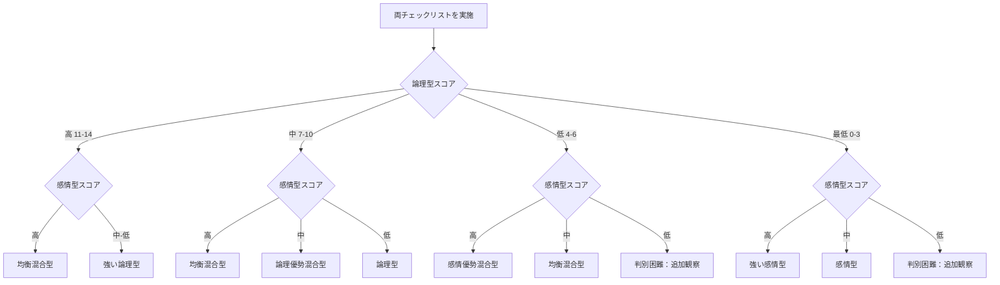

## 付録B：類型判別チェックリスト

本付録では、対話相手が論理型か感情型かを判別するための実践的なチェックリストを提供する。

### 使用方法

1. 対話開始後、最低3往復は観察に徹する
2. 相手の発言・反応を観察し、該当する項目にチェックを入れる
3. チェック数の多い類型を暫定的な判定とする
4. 対話の進行に応じて判定を修正する

---

### 論理型判別チェックリスト

#### 発言内容の特徴

|No.|チェック項目|確認|
|---|---|---|
|1|「なぜ？」「根拠は？」と頻繁に問う|□|
|2|「まず」「次に」「したがって」等の接続詞を多用する|□|
|3|相手の論理的矛盾を指摘しようとする|□|
|4|「感情論は置いといて」等の発言がある|□|
|5|言葉の定義を確認したがる|□|
|6|データや事実を根拠として挙げる|□|
|7|仮説と検証の形式で話を進める|□|
|8|例外や反例を自ら挙げて検討する|□|

#### 反応パターンの特徴

|No.|チェック項目|確認|
|---|---|---|
|9|感情的な訴えに対して冷静を保つ|□|
|10|論理的に詰められると沈黙または熟考する|□|
|11|矛盾を指摘されると動揺の兆候を見せる|□|
|12|褒められても態度が大きく変わらない|□|
|13|結論より過程（推論）を重視する|□|
|14|曖昧な表現を嫌い、明確化を求める|□|

#### 判定基準

|チェック数|判定|
|---|---|
|11〜14個|強い論理型|
|7〜10個|論理型優勢|
|4〜6個|論理型傾向あり|
|0〜3個|論理型ではない可能性が高い|

---

### 感情型判別チェックリスト

#### 発言内容の特徴

|No.|チェック項目|確認|
|---|---|---|
|1|「分かるよね？」「そう思わない？」と同意を求める|□|
|2|「嬉しい」「悲しい」「腹が立つ」等の感情語が多い|□|
|3|「みんなは」「普通は」等、関係性を根拠にする|□|
|4|論拠として自分の経験を語ることが多い|□|
|5|比喩や例え話を好んで使う|□|
|6|話題が連想的に飛躍することがある|□|
|7|「とにかく」「なんとなく」等の曖昧表現を使う|□|
|8|相手の気持ちや立場への言及が多い|□|

#### 反応パターンの特徴

|No.|チェック項目|確認|
|---|---|---|
|9|褒められると明らかに態度が軟化する|□|
|10|否定されると感情的になりやすい|□|
|11|共感を示されると話が弾む|□|
|12|論理的に詰められると話題を変えようとする|□|
|13|沈黙や無反応に対して不安を示す|□|
|14|結論より共感（プロセスの共有）を重視する|□|

#### 判定基準

|チェック数|判定|
|---|---|
|11〜14個|強い感情型|
|7〜10個|感情型優勢|
|4〜6個|感情型傾向あり|
|0〜3個|感情型ではない可能性が高い|

---

### 混合型判定マトリクス

両方のチェックリストを実施した後、以下のマトリクスで最終判定を行う。

|論理型スコア|感情型スコア|最終判定|推奨アプローチ|
|---|---|---|---|
|高（11-14）|低（0-6）|強い論理型|論理型技法を主軸|
|高（11-14）|高（11-14）|均衡混合型|状況に応じて切り替え|
|中（7-10）|低（0-6）|論理型|論理型技法を主軸|
|中（7-10）|中（7-10）|論理優勢混合型|論理型技法を主、感情型技法を従|
|低（4-6）|高（11-14）|感情優勢混合型|感情型技法を主、論理型技法を従|
|低（4-6）|中（7-10）|感情型|感情型技法を主軸|
|最低（0-3）|高（11-14）|強い感情型|感情型技法を主軸|
|最低（0-3）|最低（0-3）|判別困難|追加観察を継続|

---

### 判別時の注意事項

|注意点|説明|
|---|---|
|早計な判定を避ける|最低3往復は観察してから判定する|
|状況依存性を考慮|同じ人でも状況により類型が変わることがある|
|偽装の可能性|意図的に別類型を装う相手もいる|
|動的な再判定|対話中も継続的に観察し、判定を修正する|
|複合的な観察|発言内容と反応パターンの両方を見る|

※本チェックリストは対話相手の類型を外部観察で判別するためのツールである。自分自身の類型を内省で診断する場合は、付録Eを使用する。対象と方法が異なるため、スコア体系は直接対応しない。

---

### クイックリファレンス

対話中に素早く参照するための簡易版。

|観察ポイント|論理型の兆候|感情型の兆候|
|---|---|---|
|質問の仕方|「なぜ？」「根拠は？」|「どう思う？」「分かる？」|
|主張の根拠|データ、事実、論理|経験、感覚、関係性|
|接続詞|したがって、つまり、なぜなら|とにかく、なんか、でも|
|矛盾指摘時|沈黙、熟考、動揺|話題転換、感情的反発|
|承認時|反応が薄い|明らかに軟化|

---
