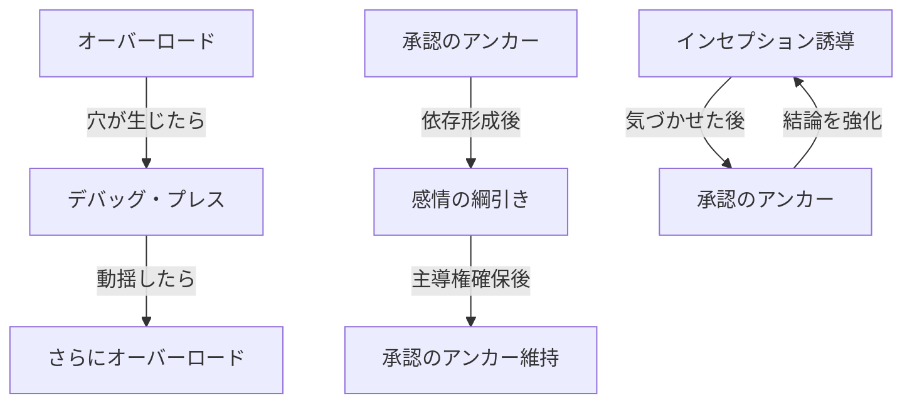

## 付録C：技法早見表

本付録では、状況別にどの技法を選択すべきかを素早く参照するためのマトリクスを提供する。

### 技法一覧

|技法名|対象類型|攻撃/防御|即効性|隠密性|
|---|---|---|---|---|
|オーバーロード|論理型|攻撃|高|低|
|デバッグ・プレス|論理型|攻撃|中|中|
|インセプション誘導|論理型|攻撃|低|高|
|感情の綱引き|感情型|攻撃|中|中|
|承認のアンカー|感情型|攻撃|低|高|
|フェイルオーバー|自己|防御|高|高|
|負荷分散の原則|自己|防御|-|-|

---

### 状況別技法選択マトリクス

#### 対論理型：状況別推奨技法

|状況|第一推奨|第二推奨|非推奨|
|---|---|---|---|
|短期決戦が必要|オーバーロード|デバッグ・プレス|インセプション誘導|
|長期的な誘導が必要|インセプション誘導|デバッグ・プレス|オーバーロード|
|相手の過去発言を把握している|デバッグ・プレス|オーバーロード|-|
|相手の過去発言を把握していない|オーバーロード|インセプション誘導|デバッグ・プレス|
|相手に気づかれたくない|インセプション誘導|-|オーバーロード|
|相手が冷静沈着|デバッグ・プレス|インセプション誘導|オーバーロード単独|
|相手が既に動揺している|オーバーロード|デバッグ・プレス|-|

#### 対感情型：状況別推奨技法

|状況|第一推奨|第二推奨|非推奨|
|---|---|---|---|
|短期決戦が必要|感情の綱引き|承認のアンカー（速攻型）|-|
|長期的な関係構築|承認のアンカー|感情の綱引き|-|
|相手が攻撃的|感情の綱引き（寄り添い重視）|-|突き放し過多|
|相手が不安定|承認のアンカー|感情の綱引き（慎重に）|突き放し過多|
|相手に気づかれたくない|承認のアンカー|-|明示的な綱引き|
|相手が承認を強く求めている|承認のアンカー|感情の綱引き|承認の拒否|
|対話が膠着している|感情の綱引き（突き放し）|-|寄り添い継続|

#### 対混合型：状況別推奨技法

|混合類型|主軸技法|補助技法|切り替えタイミング|
|---|---|---|---|
|論理優勢混合型|論理型技法|感情型技法|論理が行き詰まった時|
|均衡混合型|状況判断|状況判断|相手の反応を見て随時|
|感情優勢混合型|感情型技法|論理型技法|感情が落ち着いた時|

---

### 技法組み合わせパターン

#### 効果的な組み合わせ



|組み合わせ|流れ|効果|
|---|---|---|
|オーバーロード → デバッグ・プレス|穴を作り、穴を突く|論理型への連続攻撃|
|デバッグ・プレス → オーバーロード|動揺させ、畳みかける|論理型への追撃|
|承認のアンカー → 感情の綱引き|依存を作り、引き寄せる|感情型への段階的制圧|
|インセプション誘導 → 承認のアンカー|気づかせ、肯定する|結論の定着強化|
|感情の綱引き → インセプション誘導|主導権確保後、思考誘導|感情型への深い誘導|

#### 非推奨の組み合わせ

|組み合わせ|問題点|
|---|---|
|オーバーロード + 承認のアンカー（同時）|方向性が矛盾する|
|デバッグ・プレス + 寄り添い（同時）|一貫性がなく不信を招く|
|感情の綱引き（突き放し過多） + 承認のアンカー|承認の価値が低下する|

---

### 防御技法の発動条件

#### フェイルオーバー発動マトリクス

|状況|主系統の状態|発動判断|切り替え話法例|
|---|---|---|---|
|反論が弱い|安定|発動しない|-|
|反論が強いが対応可能|やや不安定|待機|-|
|反論に対応困難|不安定|準備開始|「確かにその視点もありますね」|
|論理的に破綻|崩壊|即座に発動|「より正確に言い直すと」|
|感情的に追い詰められた|危機|即座に発動|「別の角度から考えると」|

#### 負荷分散発動マトリクス

|自己状態|兆候|対処法|
|---|---|---|
|正常|思考明晰、余裕あり|対話継続|
|負荷増大|やや混乱、応答遅延|論点を限定する|
|高負荷|混乱、感情的反応|時間を稼ぐ、記録を外部化|
|過負荷|思考停止、強い動揺|対話を中断する|

---

### 環境設計との連携

|制圧技法|環境設計による強化方法|
|---|---|
|オーバーロード|事前に情報勾配で特定方向へ誘導しておく|
|デバッグ・プレス|非露出を維持し、中立的立場から指摘する|
|インセプション誘導|情報勾配と組み合わせ、自然な気づきを演出|
|感情の綱引き|非露出により、操作感を消す|
|承認のアンカー|情報勾配で承認すべきポイントを設計しておく|

---

### クイックリファレンスカード

対話中に即座に参照するための最小限の早見表。

```
【論理型への攻撃】
・短期決戦 → オーバーロード
・証拠あり → デバッグ・プレス
・長期誘導 → インセプション誘導

【感情型への攻撃】
・関係構築 → 承認のアンカー
・主導権奪取 → 感情の綱引き

【自己防衛】
・主張崩壊 → フェイルオーバー
・負荷増大 → 論点限定、時間稼ぎ

【危険信号】
・思考が混乱 → 即座に負荷分散
・論理破綻 → 即座にフェイルオーバー
```

---
