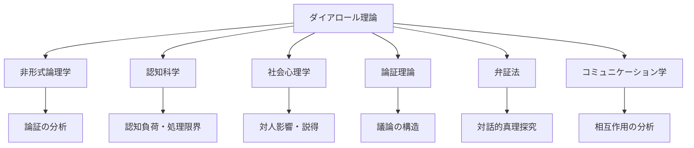
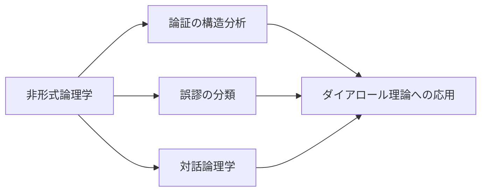
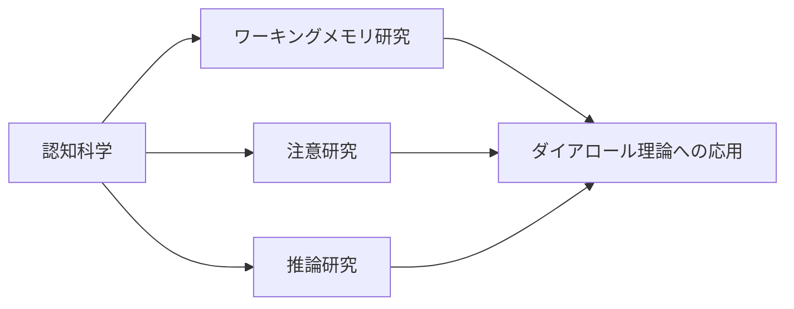
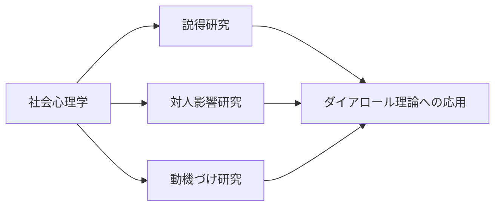
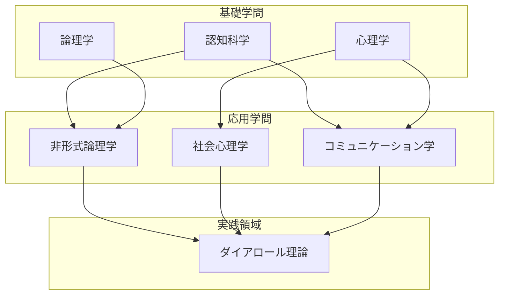

## 付録D：関連学問との対応表

本付録では、ダイアロール理論の各要素が既存の学問領域とどのように対応するかを整理する。これにより、理論の学術的位置づけを明確にし、さらなる学習への橋渡しとする。

### 理論全体の学問的位置づけ

---

### 階層別対応表

#### 第I章：認知基盤論

|理論内概念|関連学問|対応する学術概念|主要研究者・文献|
|---|---|---|---|
|認知容量の有限性|認知科学|ワーキングメモリ容量|Baddeley & Hitch (1974)|
|情報処理の限界|認知心理学|チャンク、マジカルナンバー7±2|Miller (1956)|
|認知負荷|教育心理学|認知負荷理論|Sweller (1988)|
|推論負荷と脆弱性|認知科学|二重過程理論|Kahneman (2011)|
|前提リセット|論理学|非単調推論|Reiter (1980)|

|学習を深めるためのキーワード|
|---|
|ワーキングメモリ (Working Memory)|
|認知負荷理論 (Cognitive Load Theory)|
|限定合理性 (Bounded Rationality)|
|二重過程理論 (Dual Process Theory)|
|システム1とシステム2|

#### 第II章：脆弱性類型論

|理論内概念|関連学問|対応する学術概念|主要研究者・文献|
|---|---|---|---|
|論理型・感情型の分類|心理学|認知スタイル|Riding & Cheema (1991)|
|論理型の特性|認知心理学|分析的思考|Stanovich & West (2000)|
|感情型の特性|社会心理学|経験的処理|Epstein (1994)|
|承認欲求|動機づけ心理学|自己決定理論、承認欲求|Maslow (1943), Deci & Ryan (1985)|
|一貫性維持の負荷|社会心理学|認知的不協和理論|Festinger (1957)|

|学習を深めるためのキーワード|
|---|
|認知スタイル (Cognitive Style)|
|認知的不協和 (Cognitive Dissonance)|
|経験過程理論 (Cognitive-Experiential Self-Theory)|
|欲求階層説 (Hierarchy of Needs)|
|分析的-直感的思考 (Analytical-Intuitive Thinking)|

#### 第III章：制圧技法論

|理論内概念|関連学問|対応する学術概念|主要研究者・文献|
|---|---|---|---|
|オーバーロード|認知科学|情報過負荷|Toffler (1970)|
|デバッグ・プレス|非形式論理学|論証分析、矛盾の指摘|Walton (1989)|
|インセプション誘導|社会心理学|プライミング、誘導|Bargh & Chartrand (1999)|
|感情の綱引き|社会心理学|間欠的強化|Skinner (1938)|
|承認のアンカー|社会心理学|社会的強化、好意の返報性|Cialdini (1984)|

|学習を深めるためのキーワード|
|---|
|情報過負荷 (Information Overload)|
|論証スキーム (Argumentation Schemes)|
|プライミング効果 (Priming Effect)|
|間欠的強化 (Intermittent Reinforcement)|
|返報性の原理 (Reciprocity Principle)|
|説得の心理学 (Psychology of Persuasion)|

#### 第IV章：防衛機構論

|理論内概念|関連学問|対応する学術概念|主要研究者・文献|
|---|---|---|---|
|フェイルオーバー|システム工学|冗長性設計、フェイルセーフ|-|
|主張の二重化|論証理論|論証の予備線|Walton (2006)|
|負荷分散|認知科学|メタ認知、認知資源管理|Flavell (1979)|
|自己監視|心理学|セルフモニタリング|Snyder (1974)|

|学習を深めるためのキーワード|
|---|
|メタ認知 (Metacognition)|
|セルフモニタリング (Self-Monitoring)|
|認知資源 (Cognitive Resources)|
|冗長性 (Redundancy)|
|レジリエンス (Resilience)|

#### 第V章：環境設計論

|理論内概念|関連学問|対応する学術概念|主要研究者・文献|
|---|---|---|---|
|情報勾配|行動経済学|ナッジ、選択アーキテクチャ|Thaler & Sunstein (2008)|
|環境設計|建築学・設計学|アフォーダンス|Gibson (1979)|
|非露出の原則|社会学|権力の不可視性|Lukes (1974)|
|間接的誘導|政治哲学|リバタリアン・パターナリズム|Thaler & Sunstein (2003)|

|学習を深めるためのキーワード|
|---|
|ナッジ理論 (Nudge Theory)|
|選択アーキテクチャ (Choice Architecture)|
|アフォーダンス (Affordance)|
|権力の三次元 (Three Dimensions of Power)|
|構造的権力 (Structural Power)|

---

### 学問領域別対応表

#### 非形式論理学との対応

|ダイアロール理論|非形式論理学|
|---|---|
|論理の穴|論証の誤謬 (Fallacy)|
|デバッグ・プレス|論証分析 (Argument Analysis)|
|前提リセット|前提の再構築 (Premise Revision)|
|一貫性維持|論理的整合性 (Logical Consistency)|
|オーバーロード|複合的質問の誤謬への誘導|

#### 認知科学との対応

|ダイアロール理論|認知科学|
|---|---|
|認知容量|ワーキングメモリ容量|
|認知負荷|認知負荷 (内在的・外在的・関連的)|
|推論負荷|制御的処理の負荷|
|情報処理限界|注意資源の限界|
|前提リセット|作業記憶の更新機能|

#### 社会心理学との対応

|ダイアロール理論|社会心理学|
|---|---|
|承認欲求|所属欲求、承認欲求|
|感情の綱引き|間欠的強化、感情操作|
|承認のアンカー|好意の返報性、社会的強化|
|インセプション誘導|プライミング、暗示|
|依存形成|心理的依存、関係依存|

---

### 発展的学習のためのブックリスト

| 領域     | 推奨文献                      | 関連する章     |
| ------ | ------------------------- | --------- |
| 認知科学入門 | 『ファスト＆スロー』D.カーネマン         | 第I章       |
| 論証理論   | 『議論の技法』S.トゥールミン           | 第I章、第III章 |
| 説得の心理学 | 『影響力の武器』R.チャルディーニ         | 第III章     |
| 行動経済学  | 『ナッジ』R.セイラー & C.サンスティーン   | 第V章       |
| 非形式論理学 | 『クリティカルシンキング入門』E.B.ゼックミスタ | 全章        |
| 認知負荷理論 | 『インストラクショナルデザインの原理』R.メイヤー | 第I章       |

---

### 学問的位置づけの要約

|位置づけ|説明|
|---|---|
|学問的性質|複数領域を横断する学際的理論|
|理論的基盤|認知科学、非形式論理学、社会心理学|
|実践的性質|学術研究より実践応用を重視|
|発展可能性|各基礎学問の進展により更新可能|

---
