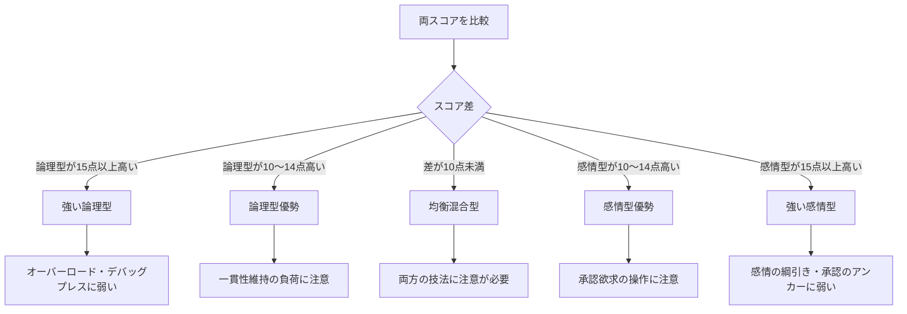
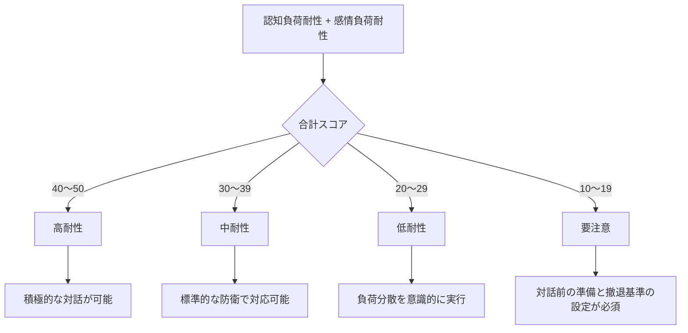
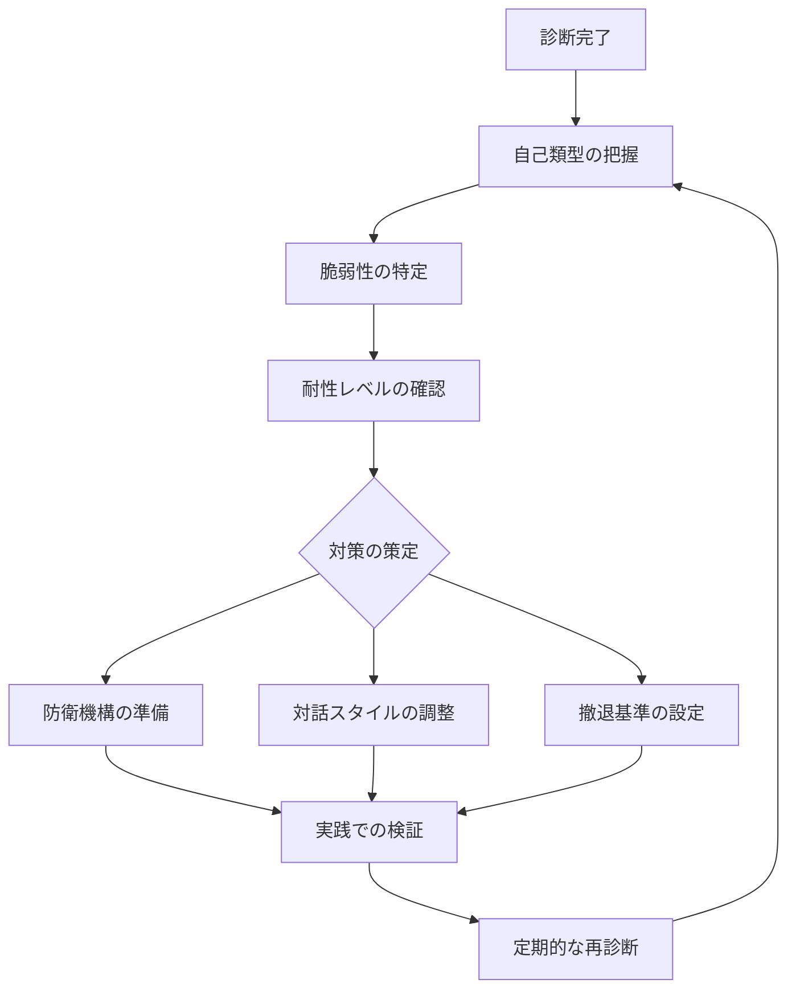

## 付録E：自己診断シート

本付録では、自分自身の認知的脆弱性を把握し、防衛機構を構築するための自己診断ツールを提供する。

### 使用目的

1. 自分がどの類型に近いかを把握する
2. 自分の脆弱性がどこにあるかを特定する
3. 優先的に強化すべき防衛機構を明確にする
4. 自己オーバーロードの兆候を早期発見する

※本シートは自分自身の類型を内省で診断するためのツールである。対話相手の類型を外部観察で判別する場合は、付録Bを使用する。対象と方法が異なるため、スコア体系は直接対応しない。

---

### 第1部：自己類型診断

#### 1.1 論理型傾向チェック

以下の項目について、自分に当てはまる程度を評価する。

|No.|項目|全く当てはまらない|あまり当てはまらない|どちらとも言えない|やや当てはまる|強く当てはまる|
|---|---|---|---|---|---|---|
|1|主張する時は必ず根拠を示したい|1|2|3|4|5|
|2|矛盾を指摘されると非常に気になる|1|2|3|4|5|
|3|感情的な議論は苦手だ|1|2|3|4|5|
|4|言葉の定義を曖昧にしたくない|1|2|3|4|5|
|5|結論より論理的過程を重視する|1|2|3|4|5|
|6|相手の論理の穴を見つけると指摘したくなる|1|2|3|4|5|
|7|「なんとなく」という理由では納得できない|1|2|3|4|5|
|8|過去の自分の発言との整合性を気にする|1|2|3|4|5|

**論理型傾向スコア：______ / 40点**

#### 1.2 感情型傾向チェック

|No.|項目|全く当てはまらない|あまり当てはまらない|どちらとも言えない|やや当てはまる|強く当てはまる|
|---|---|---|---|---|---|---|
|1|相手に共感してもらえると嬉しい|1|2|3|4|5|
|2|褒められるとやる気が出る|1|2|3|4|5|
|3|否定されると落ち込みやすい|1|2|3|4|5|
|4|直感を大事にしている|1|2|3|4|5|
|5|人間関係を重視する|1|2|3|4|5|
|6|自分の経験をもとに判断することが多い|1|2|3|4|5|
|7|議論より対話を好む|1|2|3|4|5|
|8|相手の反応が気になる|1|2|3|4|5|

**感情型傾向スコア：______ / 40点**

#### 1.3 自己類型判定



|判定結果|スコア条件|主な脆弱性|
|---|---|---|
|強い論理型|論理型35以上、差15以上|オーバーロード、デバッグ・プレスに弱い|
|論理型優勢|論理型が10〜14点高い|一貫性維持の負荷に注意|
|均衡混合型|差が10点未満|状況により脆弱性が変化|
|感情型優勢|感情型が10〜14点高い|承認欲求の操作に注意|
|強い感情型|感情型35以上、差15以上|感情の綱引き、承認のアンカーに弱い|

---

### 第2部：脆弱性特定診断

#### 2.1 論理型脆弱性チェック

自分が論理型傾向を持つ場合、以下の脆弱性がどの程度あるかを評価する。

|No.|脆弱性項目|低い|やや低い|中程度|やや高い|高い|
|---|---|---|---|---|---|---|
|1|複数の論点を同時に処理すると混乱する|1|2|3|4|5|
|2|過去の発言との矛盾を指摘されると動揺する|1|2|3|4|5|
|3|論理的に追い詰められると感情的になる|1|2|3|4|5|
|4|自分で気づいたことは強く信じてしまう|1|2|3|4|5|
|5|議論が長引くと一貫性の維持が難しくなる|1|2|3|4|5|
|6|即答を求められると判断を誤りやすい|1|2|3|4|5|

**論理型脆弱性スコア：______ / 30点**

|スコア|脆弱性レベル|推奨対策|
|---|---|---|
|6〜12|低い|現状維持、基本的な防衛意識|
|13〜18|中程度|負荷分散の原則を習得|
|19〜24|高い|フェイルオーバーの準備を徹底|
|25〜30|非常に高い|対話前の入念な準備が必須|

#### 2.2 感情型脆弱性チェック

自分が感情型傾向を持つ場合、以下の脆弱性がどの程度あるかを評価する。

|No.|脆弱性項目|低い|やや低い|中程度|やや高い|高い|
|---|---|---|---|---|---|---|
|1|肯定してくれる人を好きになりやすい|1|2|3|4|5|
|2|承認されないと不安になる|1|2|3|4|5|
|3|突き放されると何とか関係を修復したくなる|1|2|3|4|5|
|4|相手の態度の変化に敏感に反応する|1|2|3|4|5|
|5|褒められると警戒心が緩む|1|2|3|4|5|
|6|味方だと思うと相手の言葉を信じやすい|1|2|3|4|5|

**感情型脆弱性スコア：______ / 30点**

|スコア|脆弱性レベル|推奨対策|
|---|---|---|
|6〜12|低い|現状維持、基本的な防衛意識|
|13〜18|中程度|承認供給のパターンに注意|
|19〜24|高い|依存形成の兆候を早期発見|
|25〜30|非常に高い|対人関係の距離感を意識的に管理|

---

### 第3部：オーバーロード耐性診断

#### 3.1 認知負荷耐性チェック

|No.|項目|低い|やや低い|中程度|やや高い|高い|
|---|---|---|---|---|---|---|
|1|複数のタスクを同時に処理できる|1|2|3|4|5|
|2|情報が多くても整理して理解できる|1|2|3|4|5|
|3|時間的プレッシャーの中でも冷静でいられる|1|2|3|4|5|
|4|予想外の質問にも対応できる|1|2|3|4|5|
|5|長時間の議論でも集中力を維持できる|1|2|3|4|5|

**認知負荷耐性スコア：______ / 25点**

#### 3.2 感情負荷耐性チェック

|No.|項目|低い|やや低い|中程度|やや高い|高い|
|---|---|---|---|---|---|---|
|1|挑発されても冷静でいられる|1|2|3|4|5|
|2|批判を受けても感情的にならない|1|2|3|4|5|
|3|劣勢でも焦らずに対応できる|1|2|3|4|5|
|4|相手の感情に引きずられない|1|2|3|4|5|
|5|対話後も感情を引きずらない|1|2|3|4|5|

**感情負荷耐性スコア：______ / 25点**

#### 3.3 総合耐性判定



|合計スコア|耐性レベル|対話における推奨姿勢|
|---|---|---|
|40〜50|高耐性|長期戦・複雑な議論も可能|
|30〜39|中耐性|標準的な対話は問題なし|
|20〜29|低耐性|論点を絞り、短期決着を目指す|
|10〜19|要注意|重要な対話は十分な準備の上で|

---

### 第4部：リアルタイム自己監視シート

対話中に自分の状態を監視するためのチェックリスト。

#### 4.1 オーバーロード兆候チェック

|兆候|確認|検知時の対処|
|---|---|---|
|思考がまとまらなくなってきた|□|論点を限定する|
|相手の発言を聞き逃すようになった|□|復唱して時間を稼ぐ|
|応答に時間がかかるようになった|□|「少し整理させてください」と宣言|
|同じことを繰り返し言っている|□|一度立ち止まって整理|
|感情的な反応が増えてきた|□|深呼吸、意識的に冷静に|

#### 4.2 感情負荷兆候チェック

|兆候|確認|検知時の対処|
|---|---|---|
|イライラしてきた|□|反応を遅らせる|
|相手を攻撃したくなってきた|□|目的を思い出す|
|落ち込んできた|□|一時的な感情だと認識|
|相手に認められたい気持ちが強まった|□|依存形成の兆候として警戒|
|対話を放棄したくなった|□|中断を検討|

#### 4.3 撤退判断チェック

以下のいずれかに該当する場合、対話の中断を検討する。

|撤退基準|確認|
|---|---|
|オーバーロード兆候が3つ以上該当|□|
|感情負荷兆候が3つ以上該当|□|
|主系統・副系統ともに崩壊した|□|
|冷静な判断ができなくなっている|□|
|対話の目的を見失っている|□|

---

### 第5部：診断結果サマリーシート

全ての診断結果を一枚にまとめるためのサマリー。

```
【自己類型】
論理型傾向スコア：______ / 40
感情型傾向スコア：______ / 40
判定結果：__________________

【脆弱性レベル】
論理型脆弱性：______ / 30（レベル：______）
感情型脆弱性：______ / 30（レベル：______）

【耐性レベル】
認知負荷耐性：______ / 25
感情負荷耐性：______ / 25
総合耐性：______ / 50（レベル：______）

【優先強化項目】
1. ______________________
2. ______________________
3. ______________________

【注意すべき技法】
受けやすい攻撃：______________________
警戒すべき状況：______________________

【対話時の心得】
______________________________________
______________________________________
```

---

### 診断結果の活用法



|活用場面|活用方法|
|---|---|
|重要な対話の前|サマリーシートを確認し、弱点を意識|
|対話中|リアルタイム監視シートで状態を確認|
|対話後|振り返りと診断結果の更新|
|定期的|月1回程度の再診断で変化を追跡|

---
