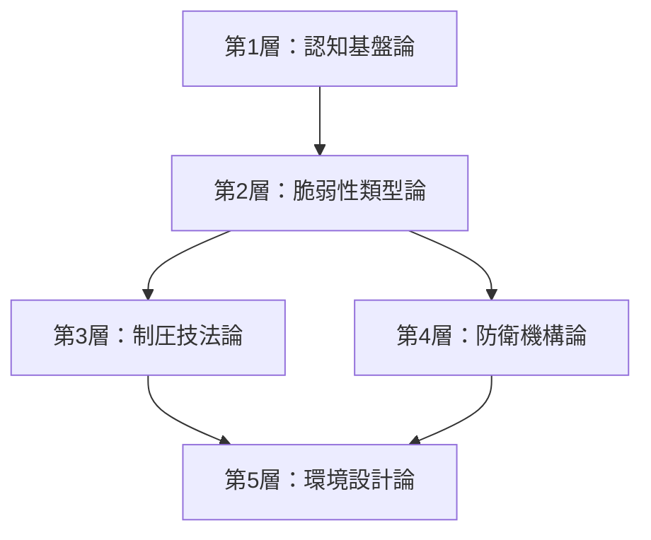

## 序章：ダイアロール理論とは

### 1. 理論の定義

ダイアロール理論とは、人間の認知構造における物理的限界を基盤として、対話における主導権の獲得・維持・防衛を体系化した実践的対話理論である。

本理論は、対話を「情報処理の競合」として捉え、相手の認知的脆弱性を理解することで、会話の流れを制御する技術を提供する。

### 2. 名称の由来

「ダイアロール（Dialole）」は、以下の三つの概念を融合した造語である。

|語源|意味|理論との関係|
|---|---|---|
|Dialogue|対話|本理論の適用領域|
|Control|制御|対話の流れを握る技術|
|Role|役割|対話における立ち位置の把握|

造語としての構成は、Dialogue の前半部 "Dia" に、Control の末尾 "ol" と Role の末尾 "le" を結合したものである（Dia + ol + le = Dialole）。

この三要素が統合されることで、「対話において役割を見極めながら流れを制御する」という本理論の本質が表現されている。

### 3. 理論の構造

ダイアロール理論は、五つの階層から構成される。

|階層|名称|役割|
|---|---|---|
|第1層|認知基盤論|理論全体の土台となる公理を定義|
|第2層|脆弱性類型論|対話相手の分類と特性を分析|
|第3層|制圧技法論|主導権確保の具体的手法を体系化|
|第4層|防衛機構論|自己の主導権を守る技術を提供|
|第5層|環境設計論|直接介入せず場を設計する原則|

### 4. 適用範囲

本理論は以下の領域での適用を想定している。

|適用領域|具体例|
|---|---|
|議論・討論|ディベート、会議での意見調整|
|交渉|ビジネス交渉、条件調整|
|日常対話|人間関係における主導権バランス|
|ゲーム|人狼ゲーム等の推理・説得ゲーム|

### 5. 本理論の前提

ダイアロール理論は、以下を前提として成立する。

1. 人間の認知能力には物理的な限界が存在する
2. その限界は対話において脆弱性として現れる
3. 脆弱性の現れ方には類型がある
4. 類型を理解すれば、適切な対応が可能になる

これらの前提は、第1層「認知基盤論」において詳述する。

---
