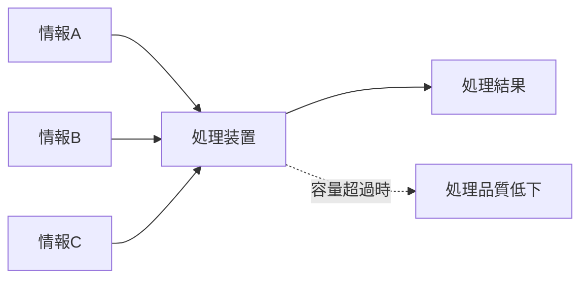
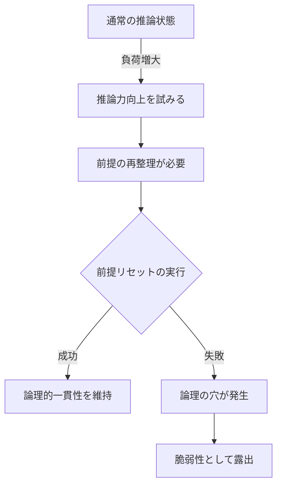
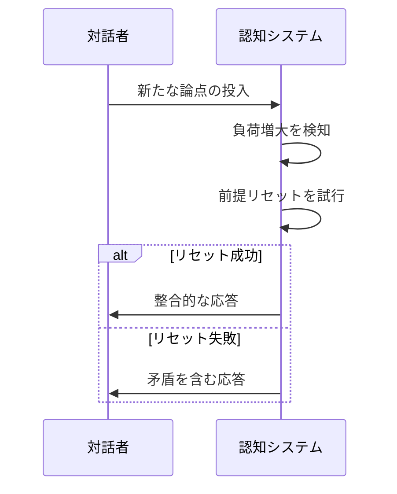
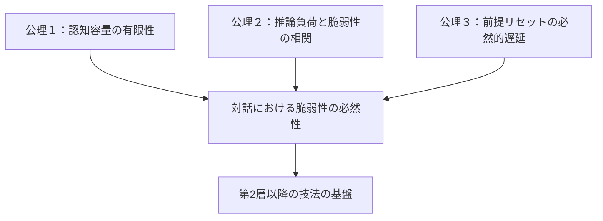

## 第I章：認知基盤論

本章では、ダイアロール理論の土台となる公理を定義する。全ての技法と戦略は、ここで述べる人間の認知構造の限界から導出される。

### 第1節：情報処理の物理的限界

#### 1.1 並列処理の困難性

人間の脳は、複数の情報を同時に処理することに向いていない。これは認知科学において「ワーキングメモリの容量限界」として知られる現象と対応する。

|状態|情報量|処理品質|結果|
|---|---|---|---|
|正常|処理能力以下|高い|論理的な応答が可能|
|負荷|処理能力と同等|中程度|応答に時間がかかる|
|過負荷|処理能力超過|低い|論理の穴が生じる|

#### 1.2 公理１：認知容量の有限性

> **人間の情報処理能力には物理的な上限が存在し、その上限を超えた情報が投入されると、処理品質は必然的に低下する。**

この公理は、ダイアロール理論における全ての技法の基盤となる。

---

### 第2節：推論負荷と論理の穴

#### 2.1 推論力向上時の脆弱性

対話において相手が推論力を引き上げようとするとき、認知負荷は増大する。このとき、必ず論理的な脆弱性が生じる。

#### 2.2 論理の穴が生じるメカニズム

|段階|認知状態|発生する現象|
|---|---|---|
|1|通常処理|既存の前提で推論を実行|
|2|負荷増大|新たな情報や論点が追加される|
|3|適応試行|より高度な推論を試みる|
|4|整理不全|前提の再整理が追いつかない|
|5|穴の発生|論理的一貫性が破綻する|

#### 2.3 公理２：推論負荷と脆弱性の相関

> **推論負荷が増大するほど、論理的脆弱性が生じる確率は上昇する。この相関は、論理学の訓練によって軽減できるが、完全には排除できない。**

---

### 第3節：前提リセットの法則

#### 3.1 前提リセットとは

推論力を正常に引き上げるためには、それまでの前提を一度リセットし、論点を再整理してから推論を再開する必要がある。これを「前提リセット」と呼ぶ。

#### 3.2 前提リセットの困難性

前提リセットが困難になる要因は以下の通りである。

|要因|説明|結果|
|---|---|---|
|時間的圧迫|対話中にリセットの時間が取れない|不完全な前提で推論を継続|
|情報量過多|整理すべき情報が多すぎる|一部の前提が欠落する|
|感情的負荷|冷静な整理が困難になる|論理より感情が優先される|
|訓練不足|リセット技術が身についていない|そもそもリセットを試みない|

#### 3.3 公理３：前提リセットの必然的遅延

> **対話中における前提リセットは、必ず遅延を伴う。この遅延中に新たな論点が投入されると、リセットは不完全に終わり、論理の穴が固定化される。**

---

### 本章のまとめ

認知基盤論で定義した三つの公理を整理する。

|公理|名称|内容|
|---|---|---|
|公理１|認知容量の有限性|情報処理能力には物理的上限がある|
|公理２|推論負荷と脆弱性の相関|負荷増大は脆弱性発生確率を上昇させる|
|公理３|前提リセットの必然的遅延|対話中のリセットは必ず遅延し、穴が生じうる|

これら三つの公理が、ダイアロール理論の全ての技法と戦略を支える基盤となる。

---
