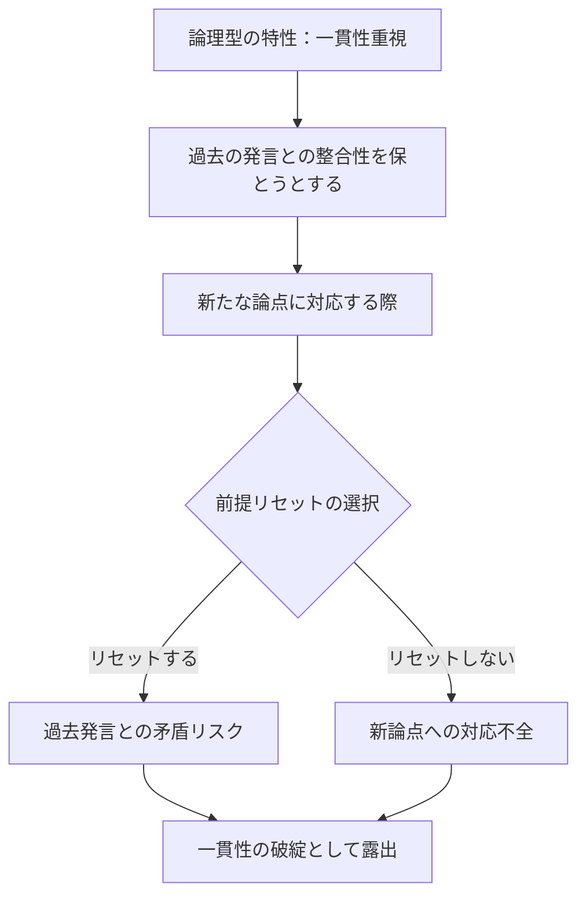
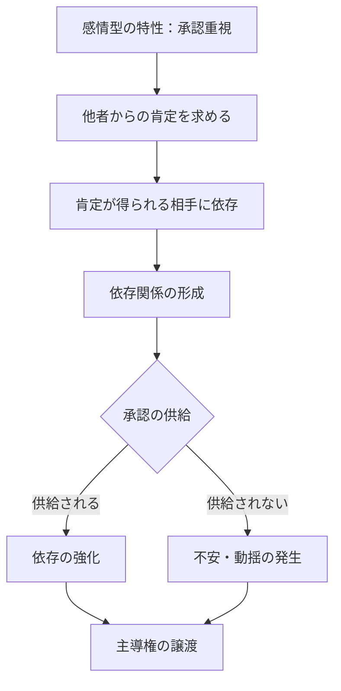
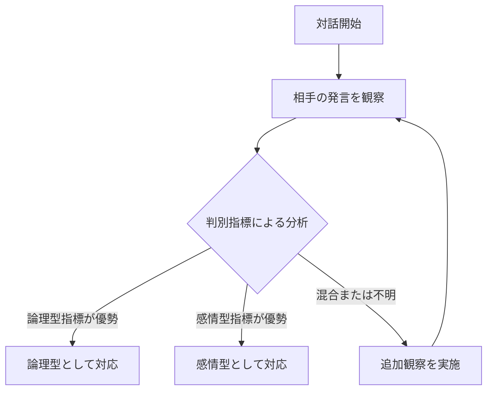
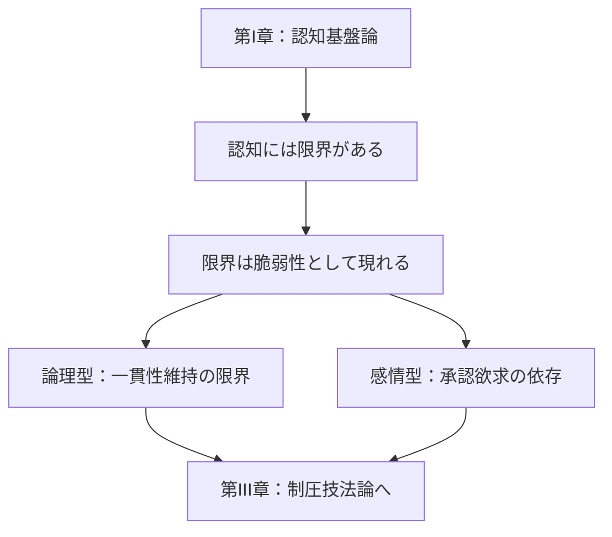

## 第II章：脆弱性類型論

本章では、対話相手を認知的特性によって分類し、それぞれの類型が持つ固有の脆弱性を分析する。第I章で定義した公理に基づき、脆弱性がどのような形で現れるかを類型別に明らかにする。

### 第1節：論理型の特性

#### 1.1 論理型の定義

論理型とは、対話において論理的一貫性を重視し、推論の整合性によって主張を構築しようとする傾向を持つ類型である。

|特徴|説明|
|---|---|
|主張の根拠|論理的推論、データ、事実|
|重視する価値|一貫性、整合性、合理性|
|対話スタイル|論点を整理し、順序立てて展開|
|強み|感情に流されにくい、論破されにくい|

#### 1.2 論理型の脆弱性構造

論理型の強みである「一貫性への拘り」は、同時に最大の脆弱性となる。

#### 1.3 一貫性維持の認知コスト

論理型は、対話が長くなるほど一貫性維持のコストが増大する。

|対話段階|維持すべき前提|認知コスト|穴の発生確率|
|---|---|---|---|
|初期|少ない|低い|低い|
|中期|増加中|中程度|中程度|
|後期|多い|高い|高い|
|長期戦|過多|限界|極めて高い|

#### 1.4 論理型の脆弱性原則

> **論理型は、一貫性を維持しようとするほど認知負荷が増大し、対話が長期化するほど論理の穴が生じる確率が上昇する。**

---

### 第2節：感情型の特性

#### 2.1 感情型の定義

感情型とは、対話において感情的共感や承認を重視し、関係性の維持によって立場を確保しようとする傾向を持つ類型である。

|特徴|説明|
|---|---|
|主張の根拠|感情、経験、直感|
|重視する価値|共感、承認、関係性|
|対話スタイル|感情を表出し、同調を求める|
|強み|論理的攻撃を受け流せる、味方を作りやすい|

#### 2.2 感情型の脆弱性構造

感情型の強みである「関係性重視」は、承認欲求への依存として脆弱性となる。

#### 2.3 承認欲求と依存の構造

感情型は、承認を供給する相手に対して主導権を渡しやすい。

|状態|承認供給|感情型の反応|主導権|
|---|---|---|---|
|安定|継続的|安心・信頼|供給者側へ移行|
|不安定|断続的|不安・執着|供給者側へ強く移行|
|欠乏|なし|動揺・攻撃性|混乱状態|
|回復|再開|安堵・感謝|供給者側へ完全移行|

#### 2.4 感情型の脆弱性原則

> **感情型は、承認欲求を満たす相手に対して依存を形成し、承認の供給・停止をコントロールされることで主導権を失う。**

---

### 第3節：類型判別の指標

#### 3.1 判別の必要性

制圧技法を適用するためには、対話相手がどの類型に属するかを正確に判別する必要がある。誤った類型判断は、技法の無効化または逆効果を招く。

#### 3.2 論理型の判別指標

|指標|具体的な兆候|
|---|---|
|根拠要求|「なぜ？」「根拠は？」と頻繁に問う|
|構造化志向|「まず」「次に」「したがって」等の接続詞を多用|
|矛盾指摘|相手の論理的矛盾を指摘しようとする|
|感情排除|「感情論は置いといて」等の発言|
|定義確認|言葉の定義を確認したがる|

#### 3.3 感情型の判別指標

|指標|具体的な兆候|
|---|---|
|同調要求|「分かるよね？」「そう思わない？」と同意を求める|
|感情表出|「嬉しい」「悲しい」「腹が立つ」等の感情語が多い|
|関係性言及|「みんなは」「普通は」等、関係性を根拠にする|
|承認反応|褒められると明らかに態度が軟化する|
|経験談多用|論拠として自分の経験を語ることが多い|

#### 3.4 混合型への対応

実際の対話において、純粋な論理型・感情型は稀であり、多くは両方の特性を持つ混合型である。

|混合類型|優勢特性|推奨アプローチ|
|---|---|---|
|論理優勢混合型|論理型70% 感情型30%|論理型技法を主、感情型技法を従|
|均衡混合型|論理型50% 感情型50%|状況に応じて技法を切り替え|
|感情優勢混合型|論理型30% 感情型70%|感情型技法を主、論理型技法を従|

#### 3.5 類型判別の原則

> **対話開始後、最低3往復は観察に徹し、判別指標を収集してから類型を判定する。早計な判定は技法選択の誤りを招く。**

---

### 本章のまとめ

脆弱性類型論で明らかにした二つの類型と判別法を整理する。

|類型|核心的特性|脆弱性の源泉|攻略の方向性|
|---|---|---|---|
|論理型|一貫性重視|一貫性維持の認知コスト|整合性の破綻を誘発|
|感情型|承認重視|承認欲求への依存|承認供給のコントロール|

---
