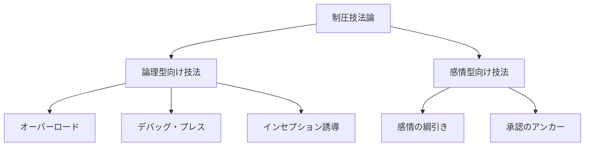
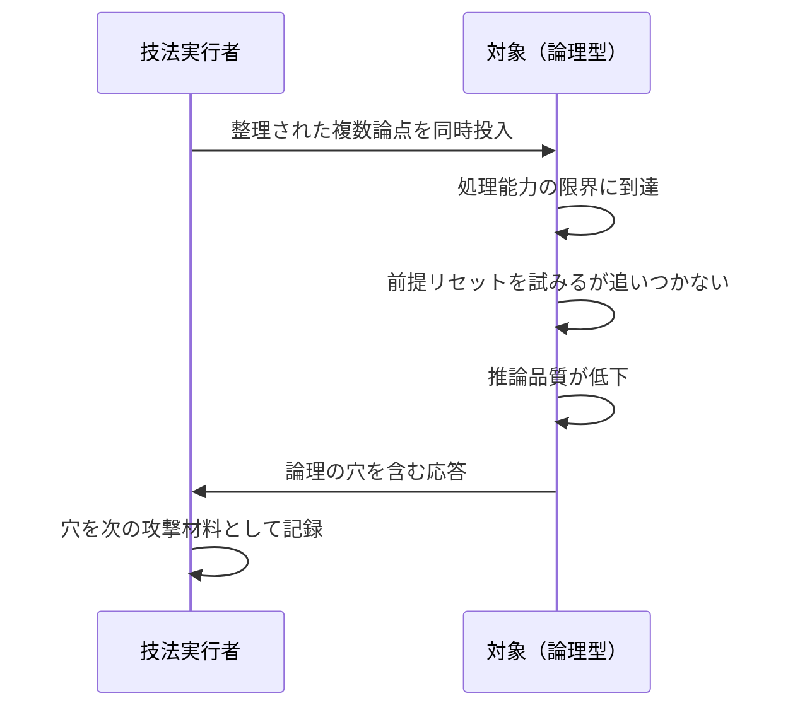
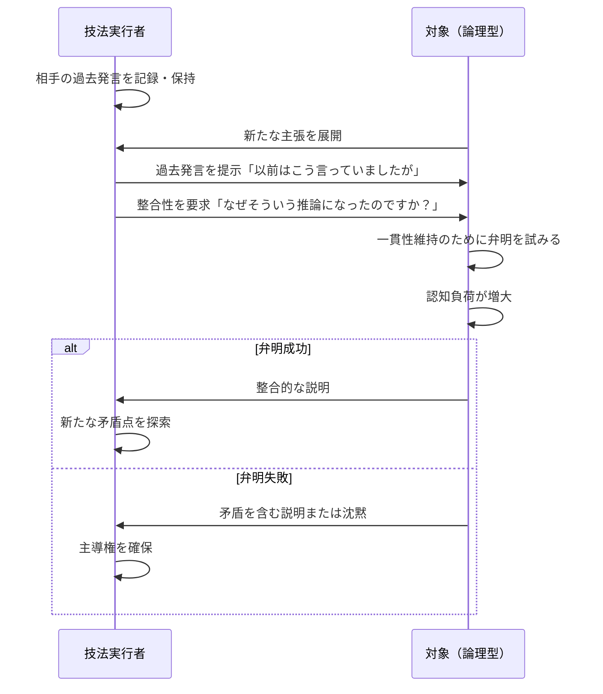
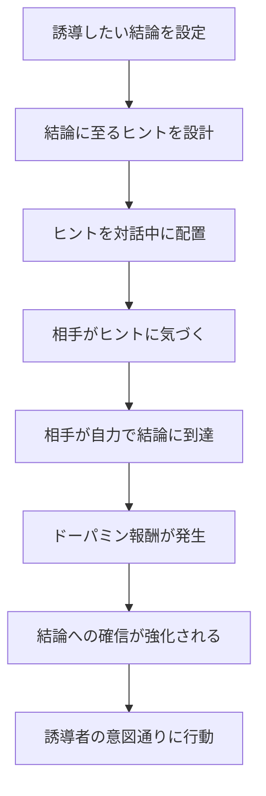
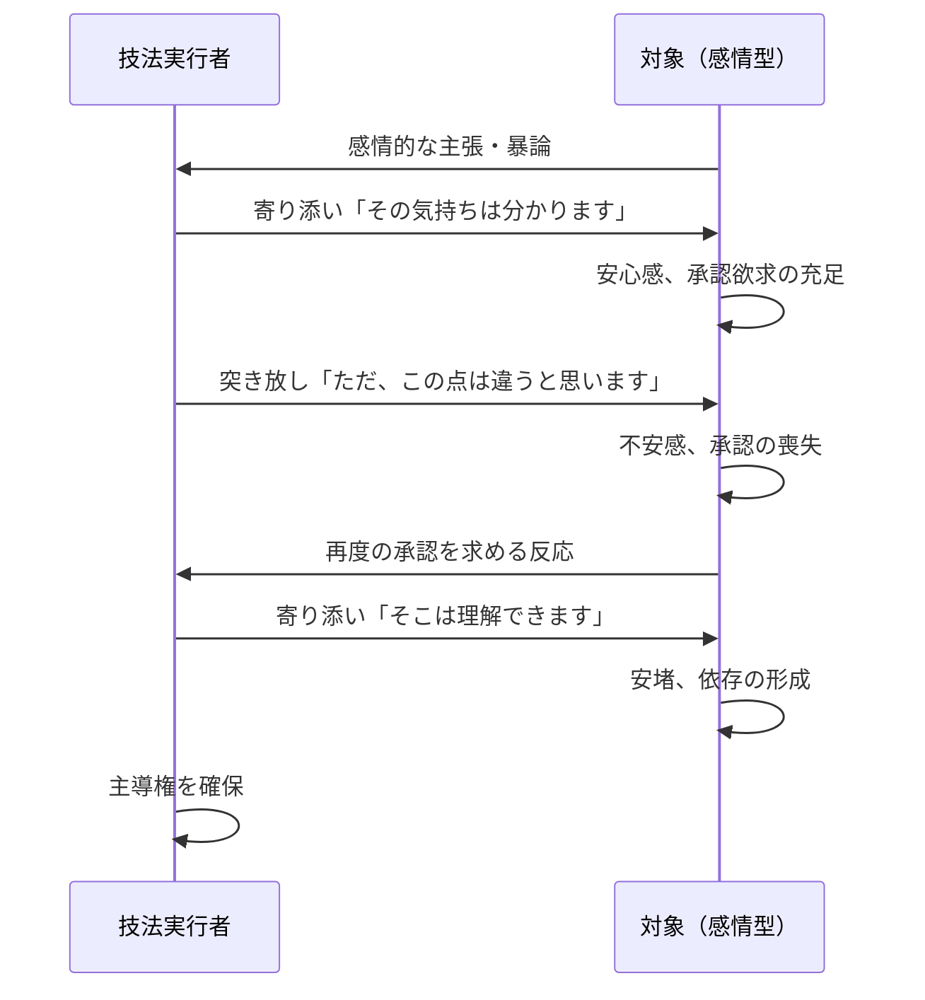
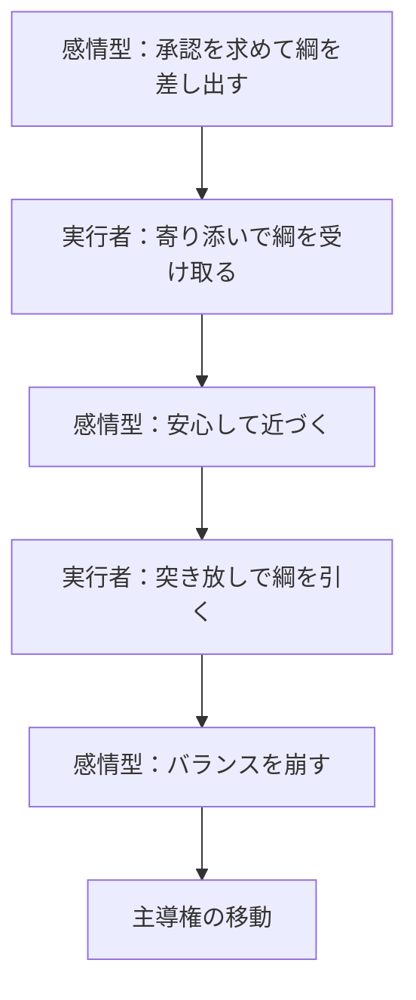
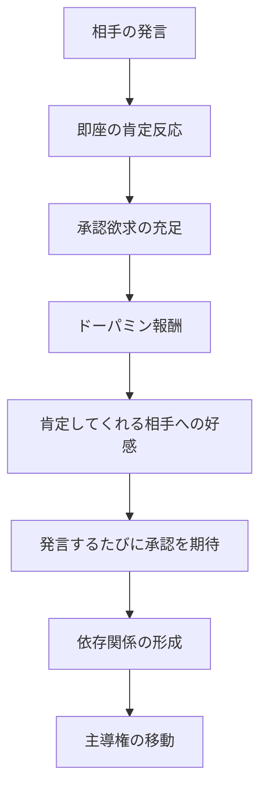
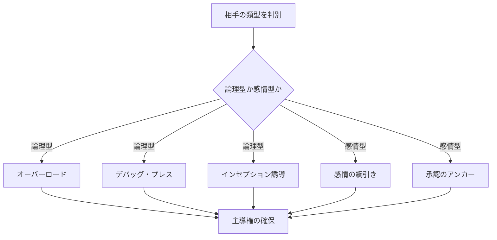

## 第III章：制圧技法論

本章では、第II章で分析した類型別脆弱性に対応する具体的な制圧技法を体系化する。制圧とは、対話における主導権を確保し、会話の流れを自らの意図する方向へ導く行為を指す。

なお、以下の技法はいずれも、第II章第3節で述べた類型判別（最低3往復の観察）が完了した後に適用する。各技法の投入タイミングに関する記述は、類型判別完了後の対話における指針である。

### 技法体系の全体像

|対象類型|技法名|攻略する脆弱性|
|---|---|---|
|論理型|オーバーロード|認知容量の限界|
|論理型|デバッグ・プレス|一貫性維持の負荷|
|論理型|インセプション誘導|自己発見欲求|
|感情型|感情の綱引き|承認欲求の不安定性|
|感情型|承認のアンカー|承認への依存性|

---

### 第1節：オーバーロード

#### 1.1 技法の定義

オーバーロードとは、相手の認知処理能力を超える密度の論点を投入し、意図的に推論品質を低下させる技法である。

#### 1.2 作用機序

#### 1.3 投入論点の設計

オーバーロードの効果は、投入する論点の質と量に依存する。

|要素|低効果|高効果|
|---|---|---|
|論点の数|1〜2個|3個以上同時|
|論点の関連性|無関係な論点|相互に関連する論点|
|論点の整理度|雑然とした提示|整理された形式での提示|
|投入タイミング|相手が余裕のある時|相手が応答した直後|

#### 1.4 整理された論点の威力

> **雑然とした情報は無視できるが、整理された論点は論理型にとって無視できない。整理されているがゆえに、全てに対応しなければならないという認知圧力が生じる。**

#### 1.5 実行上の注意

|注意点|説明|
|---|---|
|自己負荷の管理|複数論点を整理する側も負荷がかかる|
|過剰投入の回避|あまりに多いと相手が対話を放棄する|
|穴の記録|生じた穴は必ず記録し、後続技法に活用する|

---

### 第2節：デバッグ・プレス

#### 2.1 技法の定義

デバッグ・プレスとは、相手の過去発言を提示し、現在の発言との整合性を問うことで、一貫性維持の負荷を増大させる技法である。

#### 2.2 作用機序

#### 2.3 過去発言の活用法

|活用パターン|手法|効果|
|---|---|---|
|直接矛盾|明確に矛盾する発言を対置|即座に弁明を要求できる|
|暗黙矛盾|前提が矛盾する発言を対置|相手自身に矛盾を発見させる|
|文脈矛盾|文脈を変えると矛盾する発言を提示|「状況が違う」という逃げ道を塞ぐ|

#### 2.4 詰めの話法

デバッグ・プレスにおける問いかけは、冷静かつ中立的に行う。

|非推奨|推奨|
|---|---|
|「矛盾してますよね？」|「この点について説明いただけますか？」|
|「おかしいでしょ」|「どのような推論でそうなりましたか？」|
|「嘘ついてません？」|「以前の発言との関係を教えてください」|

#### 2.5 論理型の心理的反応

> **論理型は、自分の論理に穴があることを他者から指摘されることを極度に嫌う。冷徹な相手ほど、この指摘に対して動揺を見せ、その動揺がさらなる脆弱性を露出させる。**

---

### 第3節：インセプション誘導

#### 3.1 技法の定義

インセプション誘導とは、相手が「自力で気づいた」と錯覚するようにヒントを配置し、意図した方向へ思考を誘導する技法である。

#### 3.2 作用機序

#### 3.3 ヒント配置の技術

|配置方法|説明|適用場面|
|---|---|---|
|暗号型|気づく人だけが気づく形式で埋め込む|高い推論力を持つ相手|
|断片型|結論の断片を複数箇所に散りばめる|時間をかけられる対話|
|反語型|あえて逆を主張し、相手に否定させる|反発心の強い相手|
|質問型|誘導的な質問で思考方向を限定する|素直な相手|

#### 3.4 錯覚のメカニズム

|段階|相手の認知|実際の状況|
|---|---|---|
|1|「何か引っかかる」|ヒントが知覚される|
|2|「そういうことか」|ヒントが結論に結合される|
|3|「自分で気づいた」|発見の快感が生じる|
|4|「これは正しい」|自己発見ゆえに確信が強まる|
|5|「行動しよう」|誘導された方向へ動く|

#### 3.5 インセプション誘導の優位性

> **人は、他者から与えられた結論より、自分で発見した結論を強く信じる。インセプション誘導は、この心理を利用し、誘導されている自覚を持たせないまま行動を制御する。**

---

### 第4節：感情の綱引き

#### 4.1 技法の定義

感情の綱引きとは、感情型の相手に対して「寄り添い」と「突き放し」を交互に行い、主導権を獲得する技法である。

#### 4.2 作用機序

#### 4.3 寄り添いと突き放しのバランス

|パターン|比率|効果|リスク|
|---|---|---|---|
|寄り添い過多|8:2|信頼は得るが主導権は弱い|対等関係になる|
|バランス型|6:4|信頼と主導権の両立|最も推奨|
|突き放し過多|4:6|主導権は強いが反発を招く|対話が断絶する|

#### 4.4 綱引きの物理モデル

#### 4.5 感情の綱引きの本質

> **感情型は、承認を求めることで自ら綱を差し出す。実行者は寄り添いで綱を受け取り、突き放しで引き寄せる。この繰り返しにより、感情型は気づかないうちに主導権を譲渡する。**

---

### 第5節：承認のアンカー

#### 5.1 技法の定義

承認のアンカーとは、相手の発言に対して即座に肯定的反応を示すことで、承認欲求を充足させ、依存関係を構築する技法である。

#### 5.2 作用機序

#### 5.3 肯定反応の技術

|場面|反応例|効果|
|---|---|---|
|相手が意見を述べた時|「確かに！」「なるほど！」|発言を肯定されたと感じる|
|相手が質問した時|「いい質問ですね」|質問自体を評価されたと感じる|
|相手が迷っている時|「その悩みは大事ですね」|悩むこと自体を肯定されたと感じる|
|相手が結論を出した時|「そういう考え方もありますね」|思考プロセスを認められたと感じる|

#### 5.4 アンカーの設置と回収

|段階|行為|相手の状態|
|---|---|---|
|設置期|継続的に肯定反応を供給|承認の安定供給に慣れる|
|依存期|供給を維持しつつ観察|承認がないと不安になる|
|回収期|必要に応じて供給を調整|供給者の意向を気にするようになる|

#### 5.5 承認のアンカーの本質

> **人は、自分を肯定してくれる相手を敵視できない。承認のアンカーは、この心理を利用し、対立構造を回避しながら主導権を確保する。最も穏やかで、最も気づかれにくい制圧技法である。**

---

### 本章のまとめ

制圧技法論で体系化した五つの技法を整理する。

| 技法        | 対象  | 攻略点     | 特性      |
| --------- | --- | ------- | ------- |
| オーバーロード   | 論理型 | 認知容量    | 攻撃的・即効性 |
| デバッグ・プレス  | 論理型 | 一貫性維持   | 攻撃的・蓄積型 |
| インセプション誘導 | 論理型 | 自己発見欲求  | 隠密性・持続性 |
| 感情の綱引き    | 感情型 | 承認の不安定性 | 中立的・段階型 |
| 承認のアンカー   | 感情型 | 承認依存性   | 融和性・持続性 |

---
