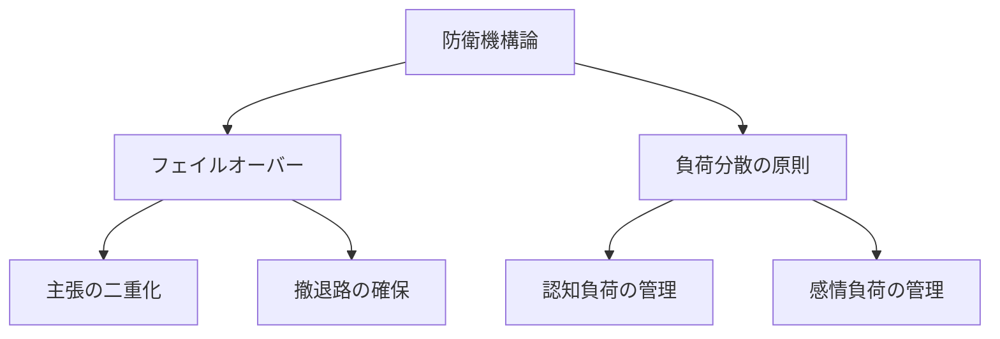
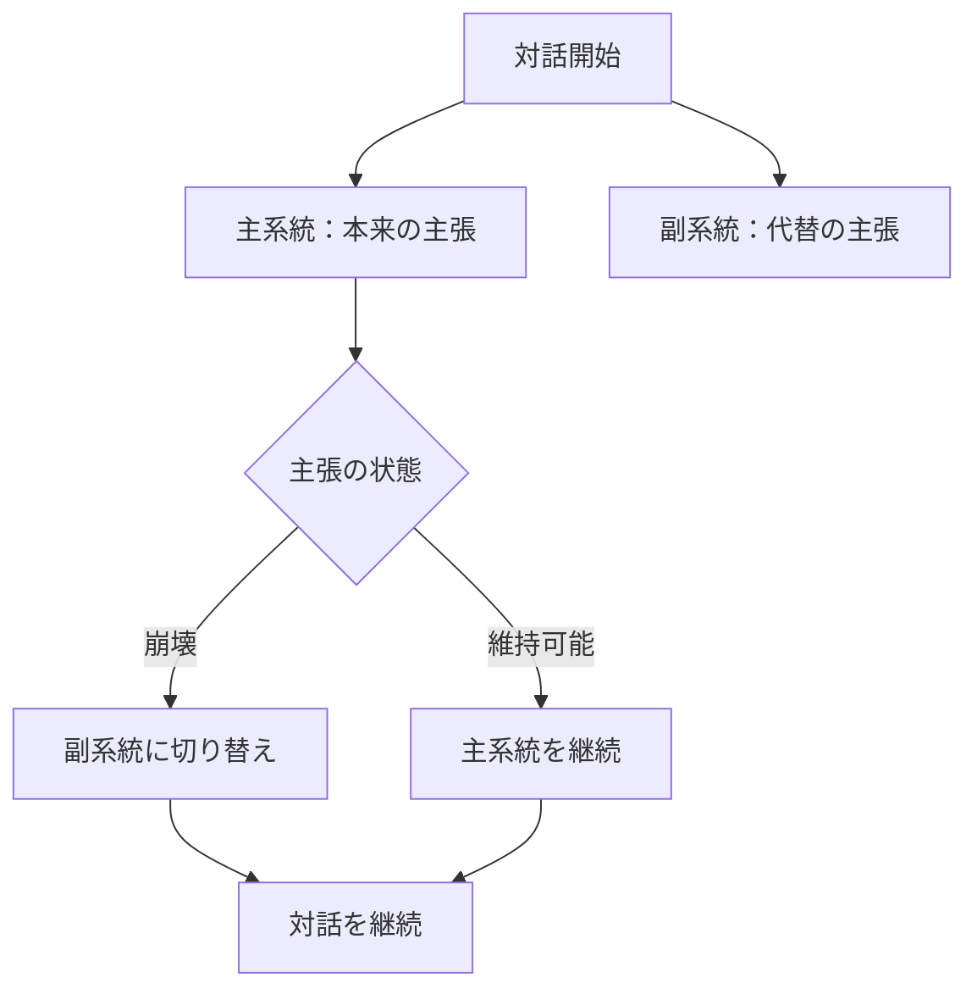
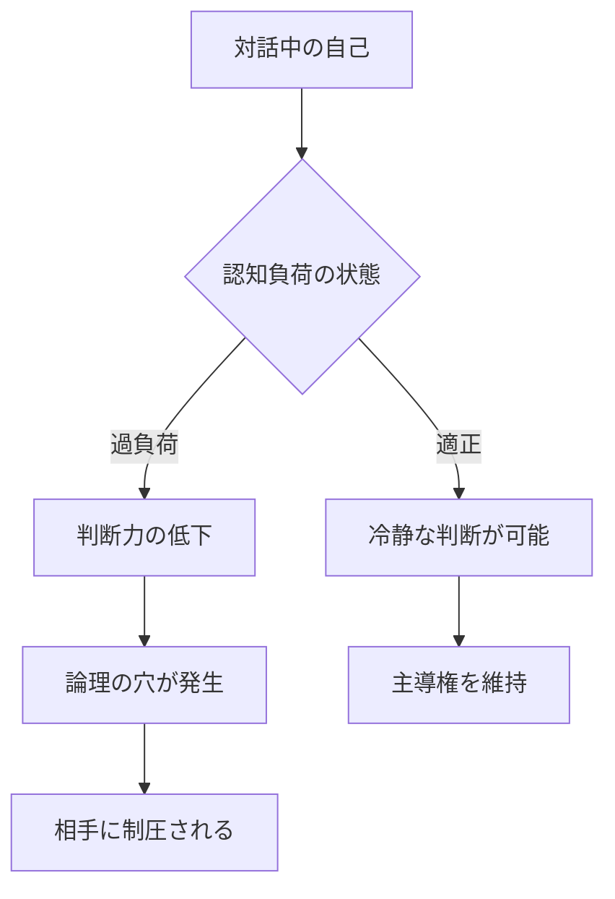
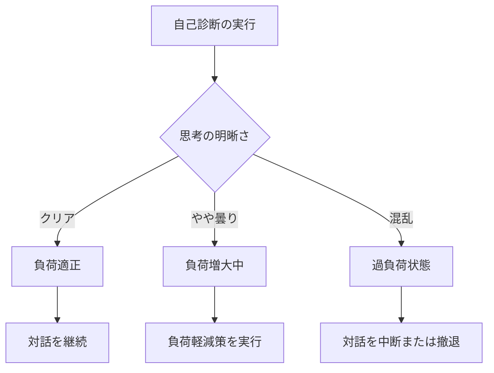
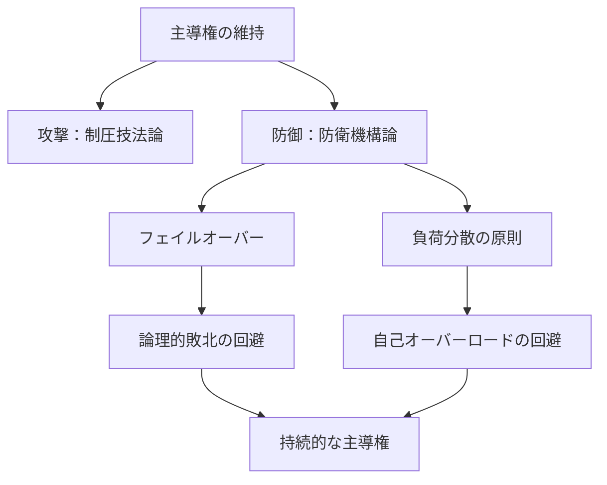

## 第IV章：防衛機構論

本章では、自己が制圧される側に回らないための防衛技術を体系化する。対話における主導権は、獲得するだけでなく維持し守る必要がある。優れた制圧者は、同時に優れた防衛者でもある。

### 防衛機構の全体像

|機構|目的|防ぐリスク|
|---|---|---|
|フェイルオーバー|主張が崩れた時の備え|論理的敗北による主導権喪失|
|負荷分散の原則|自己の処理能力を守る|オーバーロードによる自滅|

---

### 第1節：フェイルオーバー

#### 1.1 技法の定義

フェイルオーバーとは、主系統の主張が崩れた場合に備え、副系統の主張を常に準備しておく防衛機構である。システム工学における「系切り替え」の概念を対話に応用したものである。

#### 1.2 二重化の構造

#### 1.3 主系統と副系統の設計

|要素|主系統|副系統|
|---|---|---|
|内容|本来主張したいこと|周囲に合わせた主張|
|優先度|高い|中程度|
|リスク|反論される可能性あり|反論されにくい|
|目的|理想の実現|対話の継続|

#### 1.4 切り替えの判断基準

|状況|主系統の状態|判断|
|---|---|---|
|反論が弱い|維持可能|主系統を継続|
|反論が強いが対応可能|やや不安定|主系統で防戦|
|反論に対応不能|崩壊寸前|副系統に切り替え|
|論理的に破綻|崩壊|即座に副系統へ移行|

#### 1.5 切り替えの話法

副系統への切り替えは、敗北ではなく発展として提示する。

|非推奨|推奨|
|---|---|
|「すみません、間違ってました」|「その視点を踏まえると、こうも言えますね」|
|「撤回します」|「より正確に言い直すと」|
|「負けました」|「なるほど、では別の角度から考えると」|

#### 1.6 フェイルオーバーの本質

> **主系統が崩壊した際に備え、副系統を常に準備しておく者は、敗北を敗北として認識されることなく対話を継続できる。切り替えが自然であるほど、相手はそれを撤退ではなく発展として受け取る。**

---

### 第2節：負荷分散の原則

#### 2.1 原則の定義

負荷分散の原則とは、自己の認知負荷を適切に管理し、オーバーロード状態に陥ることを防ぐ防衛機構である。

#### 2.2 自己オーバーロードの危険性

#### 2.3 認知負荷の管理技術

| 技術     | 内容             | 効果           |
| ------ | -------------- | ------------ |
| 論点の限定  | 一度に扱う論点を絞る     | 処理すべき情報量を削減  |
| 記録の外部化 | 重要な情報はメモする     | ワーキングメモリを解放  |
| 時間の確保  | 即答を避け、考える時間を取る | 前提リセットの余裕を確保 |
| 撤退の判断  | 不利な論点から戦略的に離脱  | 負荷の集中を回避     |

#### 2.4 感情負荷の管理技術

認知負荷だけでなく、感情負荷も管理対象である。

| 状況      | 感情負荷      | 対処法             |
| ------- | --------- | --------------- |
| 挑発を受けた  | 怒りによる負荷増大 | 反応を遅らせ、冷静さを取り戻す |
| 劣勢に立った  | 焦りによる負荷増大 | 副系統への切り替えを検討    |
| 予想外の反論  | 動揺による負荷増大 | 「良い指摘ですね」と時間を稼ぐ |
| 長期戦になった | 疲労による負荷増大 | 対話の中断を提案する      |

#### 2.5 負荷状態の自己診断

#### 2.6 負荷分散の原則の本質

> **自己の認知負荷を常に監視し、限界に達する前に負荷を軽減する者は、判断力を維持し続けることができる。論点の限定、記録の外部化、時間の確保、そして必要に応じた撤退が、持続的な主導権維持の鍵である。**

---

### 本章のまとめ

防衛機構論で体系化した二つの機構を整理する。

| 機構       | 防衛対象      | 核心技術     | 効果            |
| -------- | --------- | -------- | ------------- |
| フェイルオーバー | 論理的破綻     | 主張の二重化   | 敗北を回避し対話を継続   |
| 負荷分散の原則  | 自己オーバーロード | 負荷の監視と管理 | 判断力を維持し主導権を守る |

---
