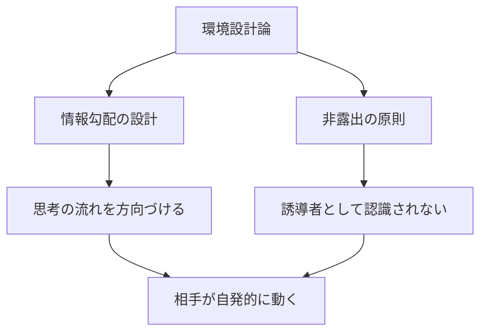
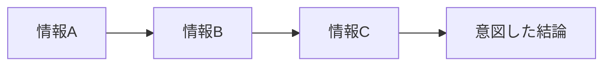
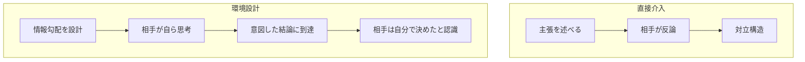
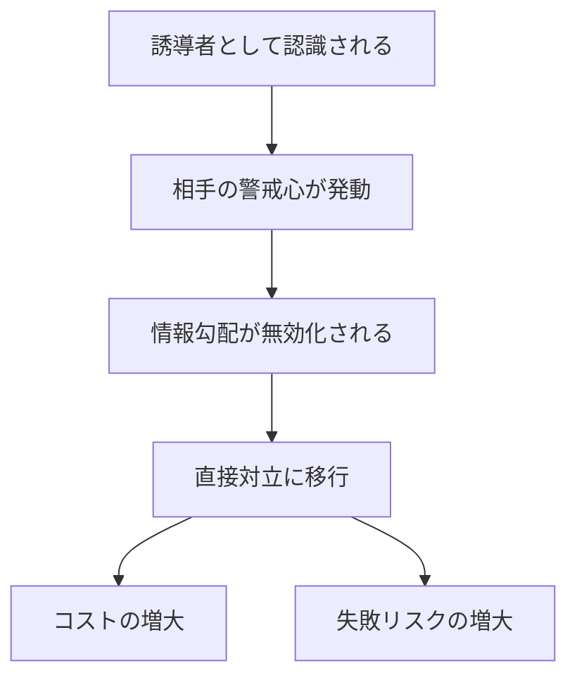
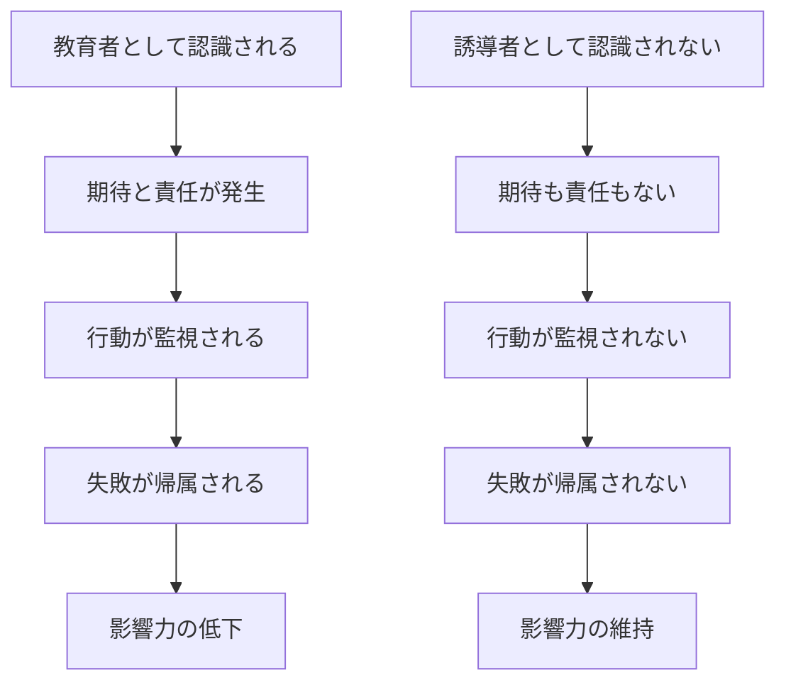
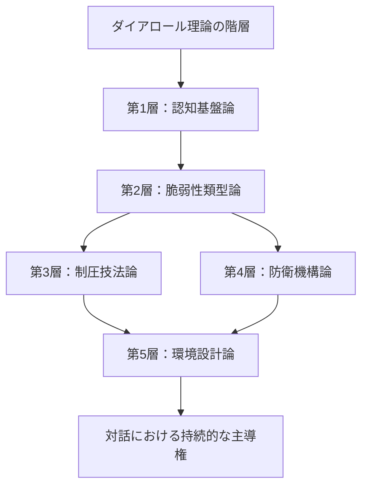

## 第V章：環境設計論

本章では、直接的な介入を行わずに対話の場そのものを設計し、相手が自然と意図した方向へ動くよう誘導する原則を体系化する。これは制圧技法の上位概念であり、技法を使う以前の「場の構造」を扱う。

### 環境設計論の全体像

|原則|目的|制圧技法との関係|
|---|---|---|
|情報勾配の設計|思考が流れる方向を作る|インセプション誘導の上位概念|
|非露出の原則|誘導の痕跡を消す|全技法の隠蔽層として機能|

---

### 第1節：情報勾配の設計

#### 1.1 概念の定義

情報勾配とは、対話空間における情報の配置によって生じる「思考の流れやすさ」の傾斜である。水が高きから低きに流れるように、思考もまた情報の勾配に沿って流れる。

#### 1.2 勾配の原理

|要素|説明|
|---|---|
|情報の配置|どの情報をどの順序で提示するか|
|情報の強調|どの情報を目立たせるか|
|情報の省略|どの情報をあえて出さないか|
|情報の関連づけ|どの情報同士を結びつけるか|

#### 1.3 勾配設計の技術

|技術|内容|効果|
|---|---|---|
|選択的提示|結論に至りやすい情報のみ提示|他の結論に至る経路を遮断|
|順序制御|情報を特定の順序で並べる|思考の流れを一方向に限定|
|空白の配置|あえて情報を欠落させる|相手が自ら埋めようとする|
|対比構造|望ましい選択肢を優位に見せる|特定の選択への誘導|

#### 1.4 直接介入との対比

|観点|直接介入|環境設計|
|---|---|---|
|痕跡|残る|残りにくい|
|抵抗|発生しやすい|発生しにくい|
|持続性|短期的|長期的|
|コスト|毎回必要|初期設計のみ|

#### 1.5 情報勾配の本質

> **直接教えるのではなく、相手が「自力で気づいた」と思えるようなヒントを配置し、特定の方向に思考が流れるように情報の勾配を作る。結果として、相手は誘導されている自覚がないまま、設計者が意図した論理を自ら進んで採用する。**

---

### 第2節：非露出の原則

#### 2.1 原則の定義

非露出の原則とは、対話において誘導者・設計者としての立ち位置を相手に認識させないことで、影響力を最大化する原則である。

#### 2.2 露出のリスク

|露出レベル|相手の認識|影響力|リスク|
|---|---|---|---|
|完全非露出|存在を認識していない|最大|最小|
|低露出|存在は認識、意図は不明|高い|低い|
|中露出|存在と一部の意図を認識|中程度|中程度|
|高露出|誘導者として完全に認識|低い|高い|

#### 2.3 非露出を維持する技術

|技術|内容|効果|
|---|---|---|
|役割の拒否|「教育者」「リーダー」等の定義可能な役割に収まらない|監視と期待を回避|
|痕跡の消去|自分の意図が見える発言を避ける|誘導の証拠を残さない|
|間接的関与|直接発言せず、場の構造だけを調整|存在感を最小化|
|帰属の分散|成果が特定の個人に帰属しないようにする|功績による露出を回避|

#### 2.4 「教育者」という罠

|立場|期待|責任|自由度|
|---|---|---|---|
|教育者|高い|高い|低い|
|リーダー|高い|高い|中程度|
|参加者|低い|低い|高い|
|不可視の設計者|なし|なし|最大|

#### 2.5 非露出の原則の本質

> **自分が教育者になるのではなく、相手が勝手に自分を導き手だと誤認する状況だけを作る。誘導の痕跡を残さないことで、影響力を維持し続けることができる。痕跡が消えるほど、影響力の持続性は高まる。**

---

### 本章のまとめ

環境設計論で体系化した二つの原則を整理する。

|原則|対象|核心|効果|
|---|---|---|---|
|情報勾配の設計|対話空間の構造|思考の流れを方向づける|相手が自発的に意図した結論へ到達|
|非露出の原則|自己の立ち位置|誘導者として認識されない|抵抗なく影響力を行使|

環境設計論は、制圧技法論と防衛機構論の上位に位置し、技法を使う以前の「場そのもの」を設計する。これにより、個別の技法を超えた持続的かつ隠密的な影響力の行使が可能となる。

---
