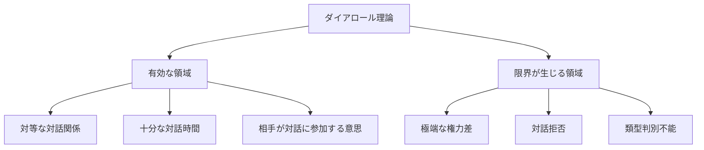
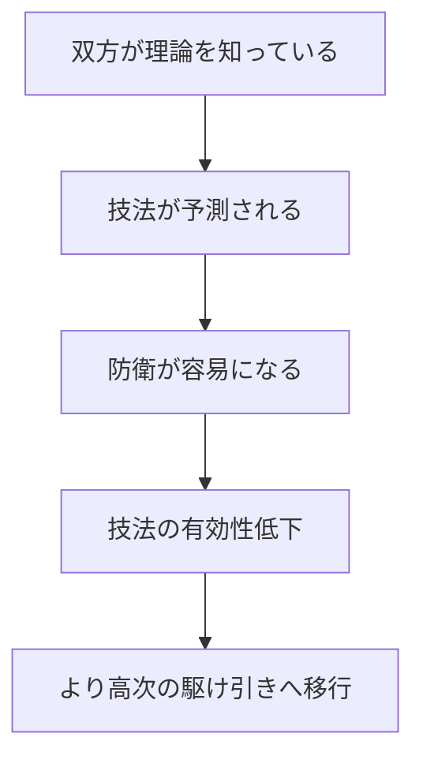
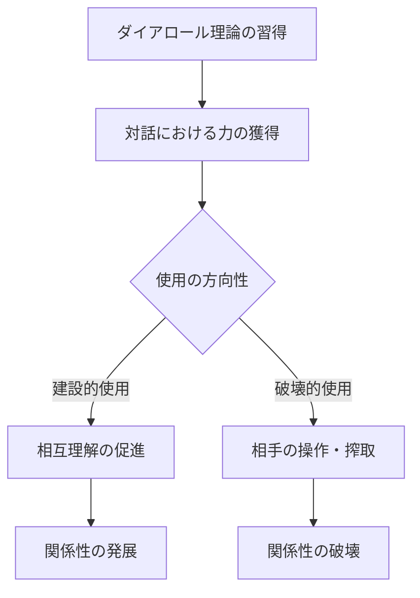
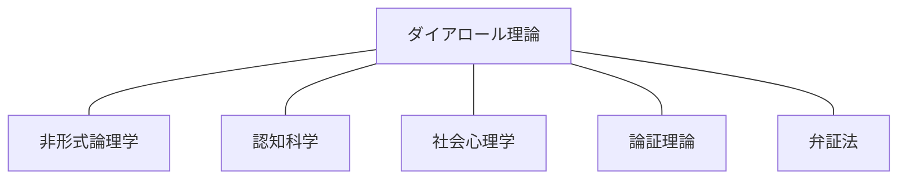
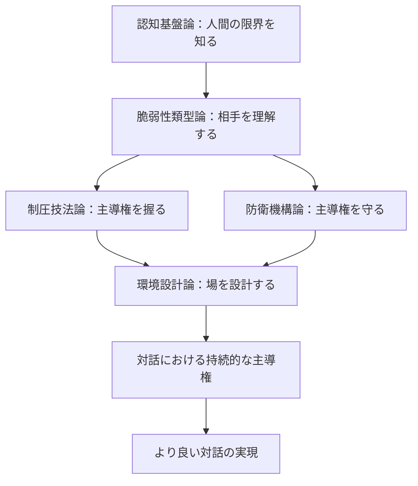

## 終章：理論の限界と倫理的考慮

本章では、ダイアロール理論の適用限界と、使用にあたっての倫理的考慮事項を述べる。いかなる理論も万能ではなく、その力には責任が伴う。

### 第1節：理論の限界

#### 1.1 適用限界の存在

ダイアロール理論は、全ての対話状況において有効なわけではない。以下に主要な限界を示す。

#### 1.2 限界の類型

|限界類型|状況|理由|
|---|---|---|
|権力的限界|相手が圧倒的な権力を持つ|対話以前に強制力が働く|
|参加的限界|相手が対話を拒否する|技法を適用する場が存在しない|
|認知的限界|相手が類型に当てはまらない|技法選択の基盤が失われる|
|時間的限界|十分な対話時間がない|類型判別や技法展開ができない|
|情報的限界|相手の情報が全くない|脆弱性の推測ができない|

#### 1.3 理論の自己適用問題

ダイアロール理論を知る者同士が対話する場合、技法の有効性は減少する。

|状況|技法有効性|対話の性質|
|---|---|---|
|相手が理論を知らない|高い|非対称的|
|相手が理論を部分的に知る|中程度|部分的に対称|
|相手が理論を熟知している|低い|対称的・高次の駆け引き|

#### 1.4 限界の受容

> **理論は道具であり、道具には適用範囲がある。ダイアロール理論の限界を知ることは、理論を正しく使うための前提条件である。**

---

### 第2節：倫理的考慮

#### 2.1 力と責任の関係

対話における主導権を握る技術は、同時に相手に影響を与える力である。力には責任が伴う。

#### 2.2 使用目的の自己点検

本理論を使用する前に、以下の点検を行うことを推奨する。

|点検項目|問い|
|---|---|
|目的の正当性|この技法を使う目的は正当か|
|手段の相当性|目的に対して手段は過剰ではないか|
|影響の考慮|相手にどのような影響を与えるか|
|代替手段|技法を使わずに達成できないか|
|長期的帰結|長期的に見て関係性はどうなるか|

#### 2.3 禁忌事項

以下の使用は、理論の本来の目的を逸脱するものとして禁忌とする。

|禁忌|理由|
|---|---|
|弱者への搾取的使用|力の非対称性の悪用|
|信頼関係の破壊目的|対話の本質に反する|
|精神的苦痛の意図的付与|人間の尊厳の侵害|
|犯罪・違法行為への応用|社会規範の逸脱|

これらの禁忌は、理論の力が大きいからこそ設けられる制約である。力の行使には、常に自制が伴わなければならない。

#### 2.4 建設的使用の指針

ダイアロール理論の建設的な使用方向を示す。

|使用場面|建設的な目的|期待される効果|
|---|---|---|
|議論・討論|生産的な結論への誘導|合意形成の促進|
|交渉|双方にとって納得できる着地点|Win-Winの実現|
|対立解消|感情的対立の鎮静化|関係性の修復|
|自己防衛|不当な攻撃からの防御|尊厳の維持|

#### 2.5 倫理的使用の本質

> **ダイアロール理論は、対話における力学を理解し、主導権を握るための知識体系である。しかし、主導権を握ることと、相手を支配することは異なる。真の主導権とは、対話をより良い方向へ導く力であり、相手を搾取する力ではない。**

---

### 第3節：理論の位置づけ

#### 3.1 学問的位置づけ

ダイアロール理論は、複数の学問領域を横断する実践的理論である。

|関連学問|関連する要素|
|---|---|
|非形式論理学|論証の脆弱性分析|
|認知科学|認知負荷、ワーキングメモリ|
|社会心理学|承認欲求、依存形成|
|論証理論|対話における主張と反論|
|弁証法|対話を通じた真理探究|

#### 3.2 実践的位置づけ

本理論は、学術的探究よりも実践的応用を重視する。

|性質|説明|
|---|---|
|実践志向|理論のための理論ではなく、使うための理論|
|状況依存|絶対的法則ではなく、状況に応じた適用|
|継続的発展|実践からのフィードバックによる更新|

---

### 結語

ダイアロール理論は、人間の認知構造の限界という普遍的事実を起点として、対話における主導権の獲得・維持・防衛を体系化した。

五つの階層、すなわち認知基盤論、脆弱性類型論、制圧技法論、防衛機構論、環境設計論は、それぞれが独立しつつも有機的に連関し、対話という複雑な現象を構造的に理解するための枠組みを提供する。

しかし、理論は使う者の意図によってその価値が決まる。本理論が、対話をより良くするための知恵として活用されることを願う。

> **対話とは、言葉による相互作用である。その相互作用の構造を理解した者は、対話の流れを読み、時に導くことができる。ダイアロール理論は、その理解への入口を提供するものである。**

---
